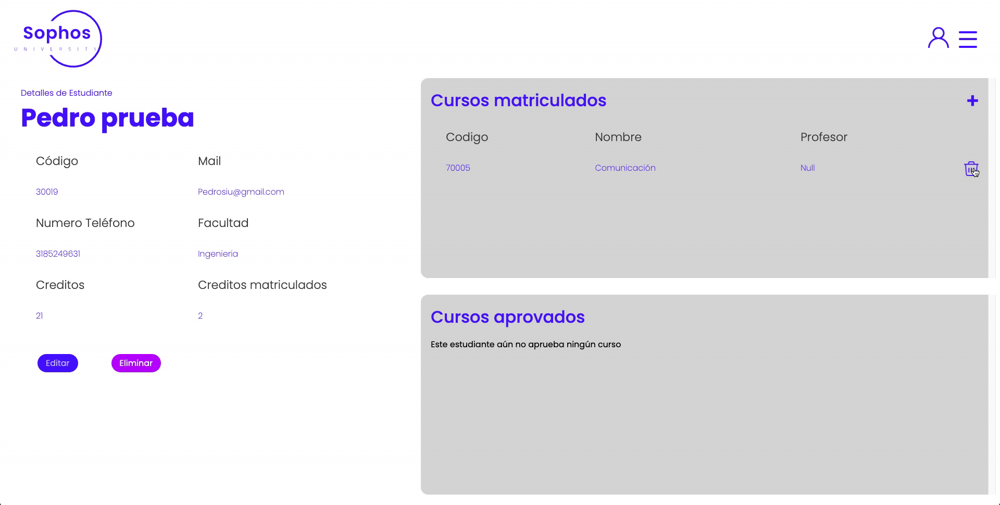

# Sophos University 🎓

This project is an information management system for Sophos University.

The approach to the problem of customer service for the students of the university was the creation of this system. From which a customer advisor can quickly and effectively answer the most common questions and processes of students during the semester. 

Solutions such as: Generate or cancel the enrolment of a course, know how many credits the student has, know which courses he/she is enrolled in, know which professor is teaching the course he/she is looking for, update his/her personal information, etc.


## Try it

To deploy this project i used Render.com for deploy each microservice and Vercel.app for deploy the FrontEnd

Try this Demo In Google Chrome and install this [Google Extensions](https://chromewebstore.google.com/detail/allow-cors-access-control/lhobafahddgcelffkeicbaginigeejlf?hl=es&pli=1) in order to avoid errors


Try It [Sophos University](https://sophosuniversity.vercel.app)


## Features

- Log In with credentials 🔐
    

- Sort lists by different fields 🔃
    

- Search by name in all lists 🔎
    

- View details of a specific student, course or teacher 🙋‍♂️
    

- Edit details of a specific student, course or teacher ✒️
    

- Create a new student, course or teacher 🆕
    

- Delete a specific student, course or teacher 🚮
    

- Enrolling a student in a course 🧑‍💻
    

- Unenrolling a student in a course 🚮
    

- Log out 🔒
    


## Tech Stack

**Client:** Angular, Sass

**Server:** Java, Spring Boot

**Data Base:** PostgreSQL


## Documentation

- Data Base 📚

[Relational Diagram](Documentation/SOPHOS%20RETO%20DB.pdf)

[Creation script](DataBaseInfo/RetoSohosDb.sql)

[Tables Creation](DataBaseInfo/TablesCreation.sql)

[Populate](DataBaseInfo/PopulationDB.sql)

- Exposed Service

[Technical Documentation](https://app.swaggerhub.com/apis/GABROVAL/SophosUniversity/1)

- UML diagrams

[Architecture Diagram of the system](Documentation/Sophos%20Uni%20Arch%20Diagram.pdf)

[Class Diagram](Documentation/Class%20diagram%20Sophos%20Uni.pdf)

- UX UI prototype 🖼️

[Prototype in figma](https://www.figma.com/proto/SAA7kxdVDMYjfOCyNRtazF/SophosUniversity?type=design&node-id=39-6&t=0D4KyggnT1HDK1vr-0&scaling=scale-down&page-id=0%3A1&starting-point-node-id=39%3A4)


    
## Run Locally

The database is in cloud so you only need:

Clone the project

```bash
  git clone https://github.com/Juanvalgreen/SophosUniversity.git
```


Make sure you have maven

```bash
  mvn -v
```


Go to the project BackEnd directory

```bash
  cd SophosUniversity/Backend
```

Go to each microservice directory and ...

  Install dependencies

  ```bash
    mvn clean 
    mvn install
  ```
  Change the restConst Variables in order to work LOCALLY

  Start the server

  ```bash
    mvn spring-boot:run
  ```

You already have the backend runnning Then

Go to FrontEnd directory

```bash
  cd SophosUniversity/FrontEnd
```

Make sure you have Node and npm

```bash
  npm -v
  node -v
```

Install dependencies

```bash
  npm install
```

Run th ng app

```bash
  ng serve -o
```


