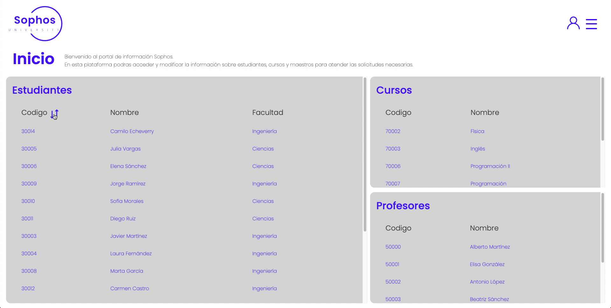
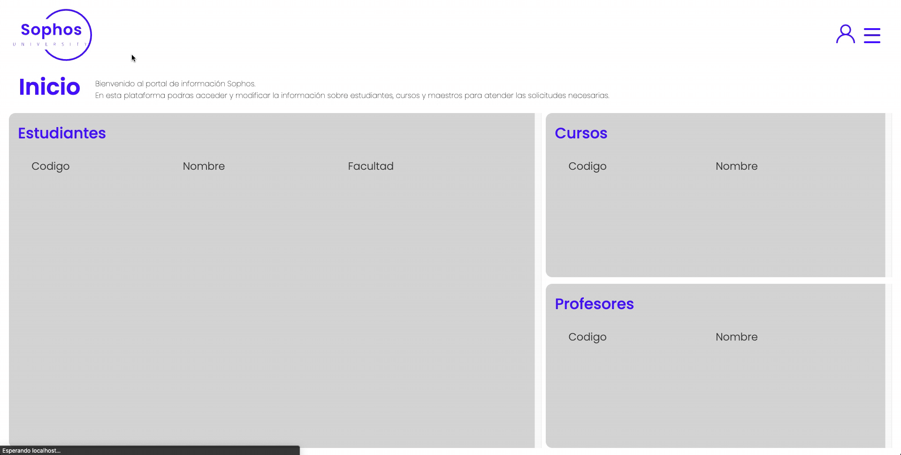

# Sophos University 🎓

This project is an information management system for Sophos University.

The approach to the problem of customer service for the students of the university was the creation of this system. From which a customer advisor can quickly and effectively answer the most common questions and processes of students during the semester. 

Solutions such as: Generate or cancel the enrolment of a course, know how many credits the student has, know which courses he/she is enrolled in, know which professor is teaching the course he/she is looking for, update his/her personal information, etc.


## Try it

To deploy this project i used aws

(specifications of deployment)

[Sophos University](link)


## Features

- Log In with credentials 🔐
    
- Sort lists by different fields 🔃
    
- Search by name in all lists 🔎
    
- View details of a specific student, course or teacher 🙋‍♂️
    
- Edit details of a specific student, course or teacher ✒️
    
- Create a new student, course or teacher 🆕
    
- Delete a specific student, course or teacher 🚮
    
- Enrolling a student in a course 🧑‍💻
    
- Unenrolling a student in a course 🚮
    
- Log out 🔒
    


## Tech Stack

**Client:** Angular, Sass

**Server:** Java, Spring Boot, Argon


## Documentation

[Documentation](https://linktodocumentation)


## Installation

Install my-project with npm

```bash
  npm install my-project
  cd my-project
```
    
## Run Locally

Clone the project

```bash
  git clone https://link-to-project
```

Go to the project directory

```bash
  cd my-project
```

Install dependencies

```bash
  npm install
```

Start the server

```bash
  npm run start
```

